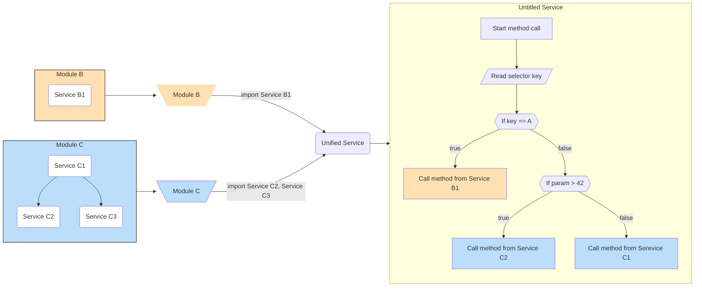
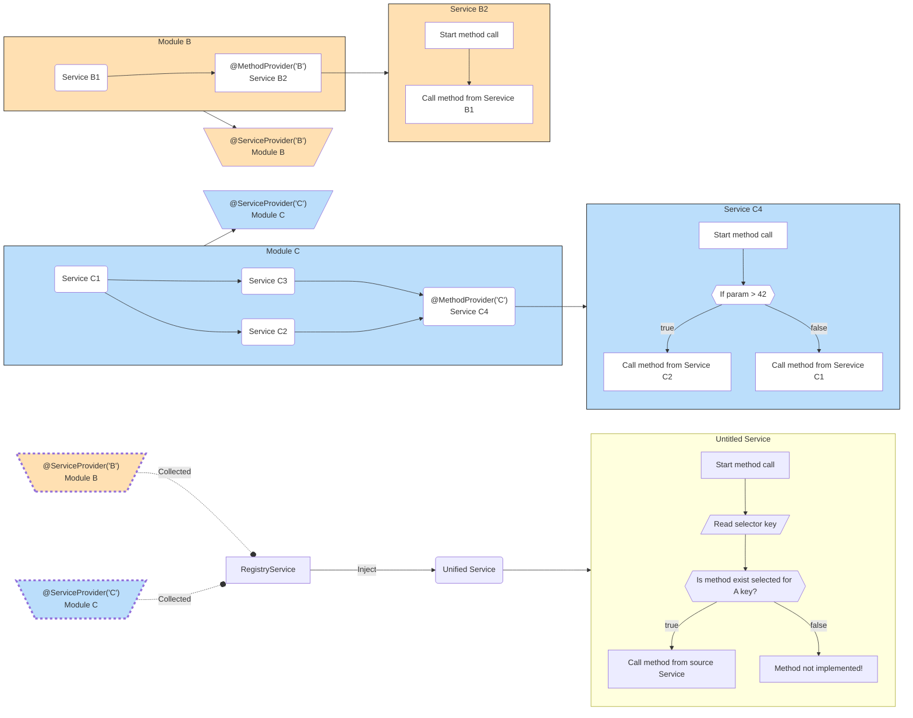

# Registry Lib

This library helps manage complex nested logic by allowing you to provide methods of multiple services within a module, accessible from anywhere in your code, without explicitly defining imports and exports.

## Motivation

When you want to provide a simple API with straightforward methods but need to manage complex logic from multiple unrelated modules, you often end up with tightly coupled code and boilerplate logic (if/else/switch statements). Adding new modules becomes cumbersome as you need to update dependencies and ensure everything integrates correctly.

One solution is to handle this import logic at runtime, for example during the application initialization phase.

This library is a NestJS module that simplifies this process by providing a service to manage such logic efficiently.

## Architecture

### Before

1. All modules bound together.
   With service exports.

    - Module B exports Service B1.
    - Module C exports Service C2 and Service C3.

    And module imports, because to use the method from services Unified Module needs to implicitly import Modules, and inject each service in Unified Service.

    Right now this looks fine, but if you need more than two different modules, that number will grow in the future, the picture starts to look terrifying.

2. Complex if/else/switch logic.
   Unified Service contains if/else/switch logic to decide which method to call based on conditions.
   All this logic leads to hardly readable boilerplate code.

3. Difficult to implement new functionality.
   Adding new features requires modifying the existing conditional logic, increasing the risk of breaking existing functionality.

### After

1. All modules are unrelated.
   These modules don't know about the existence of each other.
   So development on each of them can be independent.
   But this requires additional agreements about how to provide methods to unified service, like a shared list of interfaces that allow implementing the specific method, so that Unified Service will easily detect accessibility of method, etc.

2. All complex if/else/switch needs to be realized within each related module.
   So there need to be defined strict boundaries between modules and Unified Service.
